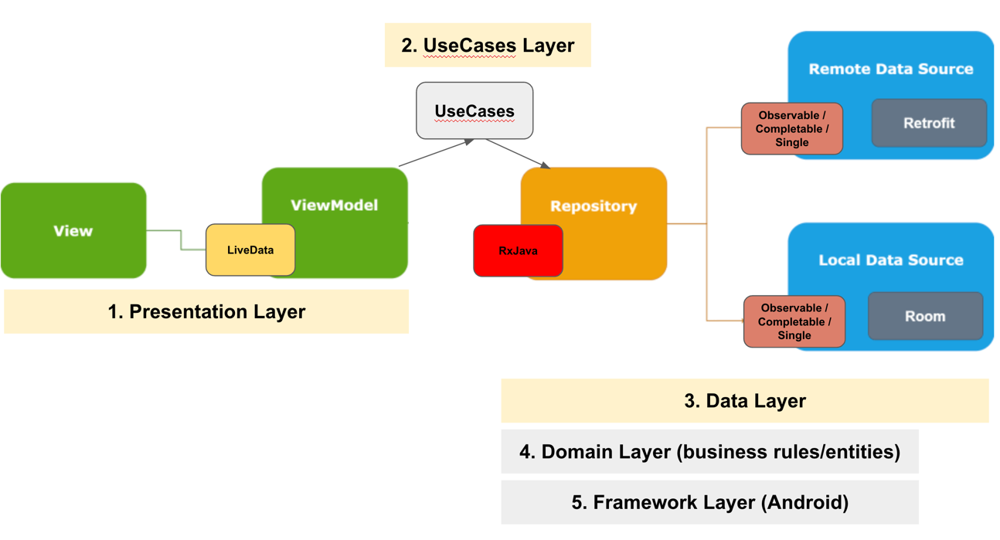
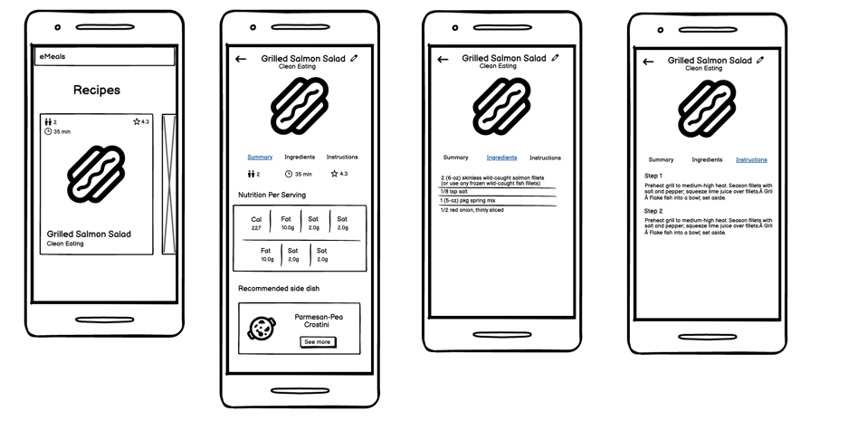
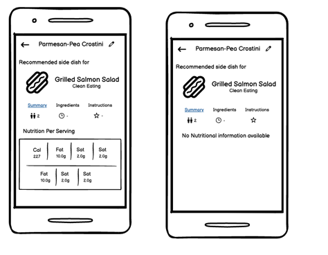

# Overview: eMeals (Android app)!
Welcome to eMeals, an Android application that provides a delightful culinary experience. This app shows delectable recipes, ensuring you have a diverse selection at your fingertips.

## What's included

A Java Android app with _modular architecture_, clean architecture, SOLID principles and _MVVM_.



Furthermore, some libraries and frameworks such as:

* _Network connectivity interceptor_ for HTTP requests.
* _Hilt_ for dependencies injection.
* _Room_ for local storage.
* _Navigation Component_ as app navigation framework.
* _Fresco_ for loading and caching images.
* _Retrofit2_ for API requests.
* _ViewPager2_ for fragments navigation between tabs.
* _RxJava_ for Reactive Functional Programming.
* _LiveData_ for observing and updating data in the UI.
* _ViewBinding_ for activities and fragments.
* _Timber_ for debug logging purposes.
* Android Studio _EditorConfig_ file to maintain consistent coding styles.
* _jUnit_, _Mockito_ and _RxJava_ for unit testing.

## Installation

Clone this repository and import it into **Android Studio**

```bash  
git clone https://github.com/JorgeDiazz/eMealsTest.git
```  

## Build variants

Herein you can find multiple targets that the app takes into account:

|          |Staging    |Production  |
|----------|-----------|------------|  
|`Internal`|Debug      |Debug       |
|`External`|Release     |Release    |

Where the following formed variants are built for staging purposes:

- stagingInternalDebug
- stagingInternalRelease

And these ones for production purposes:

- productionInternalDebug
- productionInternalRelease
- productionExternalDebug
- productionExternalRelease

**_Sidenote:_** choose productionExternalDebug before executing the app

## Mockups





## Final result

### Launching the app


### Scrolling the recipes list horizontally


### Opening recipe details screen


### Editing recipe title


### Opening side dish details screen


### Using the app in offline mode


